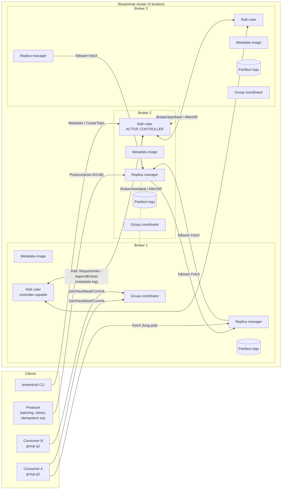

# StreamHub — Design Plan

StreamHub is a Kafka-inspired distributed message broker written in Go
(standard library only). This document is the design contract that the
code is built against. Anything marked **NOT PROVIDED** is a deliberate
non-goal, not an oversight.

---

## 1. Architecture



### Components

| Component | Package | Responsibility |
|---|---|---|
| Commit log | `internal/storage` | Append-only, segmented log per partition. Sparse offset index. CRC32-C per record. Crash recovery. Retention. Leader-epoch cache. |
| Wire protocol | `internal/protocol` | Length-prefixed binary frames over TCP, hand-written big-endian codec, correlation IDs for pipelining. |
| Transport | `internal/transport` | TCP server, pooled client connections, fault injection hooks used by tests to simulate network partitions. |
| Raft | `internal/raft` | Minimal Raft (leader election + log replication + persistence) used **only** for cluster metadata. |
| Metadata FSM | `internal/metadata` | Deterministic state machine: brokers, topics, partition assignments, leader, leader epoch, ISR, producer-ID allocation. Every broker applies the same committed log, so every broker has an identical metadata image. |
| Controller | `internal/broker/controller.go` | Runs on whichever broker is the Raft leader. Tracks broker liveness, fences dead brokers, elects partition leaders from the ISR, validates ISR changes. |
| Replica manager | `internal/broker/replica*.go` | Leader/follower role per partition, follower fetchers, high-watermark, ISR shrink/expand, acks handling, long-poll waiters. |
| Group coordinator | `internal/broker/group*.go` | Consumer-group membership, heartbeats, rebalancing, assignment (range / round-robin), committed offsets stored in the replicated `__consumer_offsets` topic. |
| Client library | `client` | Admin, Producer (batching, partitioner, retries, idempotence), Consumer (fetch, long poll, groups, commits). |
| CLI | `cmd/streamhub` | `broker`, `topic create/delete/list/describe`, `produce`, `consume`, `cluster describe`, `group list/describe`, `perf`. |
| Observability | `internal/metrics` | `log/slog` JSON logs, Prometheus text `/metrics`, `/healthz`, `/readyz`. |

---

## 2. Cluster metadata: why Raft, and what it guarantees

The metadata layer uses a **small Raft implementation** (in the spirit of
Kafka's KRaft). All brokers listed in `--peers` are Raft voters. The Raft
leader is the **active controller**.

* Metadata changes (register broker, create/delete topic, change leader/ISR,
  allocate producer IDs) are commands appended to the Raft log. A change is
  effective only once a **majority** of voters have persisted it.
* Every broker replays the committed log into its local metadata image.
  This is how brokers learn which partitions they lead or follow — there is
  no separate "push metadata" RPC.
* Fencing: every partition carries a `leaderEpoch`. Followers and clients
  reject data from a stale epoch; the controller rejects ISR changes from a
  stale epoch.

**What the Raft implementation provides**: leader election with randomized
timeouts, log matching, commit only of current-term entries via majority,
durable `currentTerm`/`votedFor`/log (fsync), crash-restart recovery.

**What it does NOT provide (honest list)**:
* No log compaction / snapshots — the metadata log grows forever. Fine for a
  learning system (metadata changes are rare), not for years of uptime.
* Static membership — voters are fixed by configuration; no joint consensus.
* No pre-vote / check-quorum extensions — a partitioned node can disrupt the
  term counter when it rejoins (safety holds; it just causes an extra election).
* Liveness needs a majority: with 3 voters, losing 2 brokers stops all
  metadata changes (no leader elections, no topic creation). Existing
  partition leaders keep serving data until their own fencing timeout.

Alternative considered: a single static controller (e.g. broker 1). Simpler,
but it is a single point of failure for leader election, which would make the
"kill a leader" requirement fail whenever the leader is broker 1. Raft removes
that SPOF at the cost of ~600 lines.

---

## 3. Wire protocol

Everything (client ↔ broker and broker ↔ broker) uses the same TCP protocol.

```
Request frame                         Response frame
+------------+                        +------------+
| len uint32 |  (bytes that follow)   | len uint32 |
+------------+                        +------------+
| api  uint16|                        | corr uint32|
| ver  uint16|                        | body ...   |
| corr uint32|                        +------------+
| body ...   |
+------------+
```

* Big-endian integers. Strings: `uint16 len + bytes`. Byte arrays:
  `int32 len + bytes` (`-1` = null). Arrays: `int32 count + elements`.
* `corr` (correlation ID) lets a client pipeline many requests on one
  connection; responses carry the same ID. The server answers requests on a
  connection **in order**, so a client may also rely on ordering.
* Every response body starts with an `int16` error code (see
  `internal/protocol/errors.go`). Error codes are classified as *retriable*
  (e.g. `NOT_LEADER`, `NOT_ENOUGH_REPLICAS`, `REQUEST_TIMED_OUT`,
  `COORDINATOR_NOT_AVAILABLE`) or fatal.
* Max frame size: 64 MiB.

### APIs

| API | Direction | Purpose |
|---|---|---|
| `Produce` | client → partition leader | Append a record batch with `acks` 0/1/-1(all), producer ID + base sequence |
| `Fetch` | client/follower → leader | Read from offset; long poll (`maxWaitMs`, `minBytes`); followers pass `replicaId` |
| `ListOffsets` | client → leader | Earliest / latest offset |
| `Metadata` | client → any broker | Brokers, controller ID, topics, partitions (leader, replicas, ISR) |
| `CreateTopic` / `DeleteTopic` | client → controller | Admin |
| `InitProducerId` | client → controller | Allocate a unique producer ID (Raft-committed) |
| `FindCoordinator` | client → any broker | Locate group coordinator |
| `JoinGroup` / `Heartbeat` / `LeaveGroup` | consumer → coordinator | Membership and rebalancing |
| `OffsetCommit` / `OffsetFetch` | consumer → coordinator | Durable committed offsets |
| `ListGroups` / `DescribeGroup` | client → coordinator(s) | Ops |
| `OffsetForLeaderEpoch` | follower → leader | Safe truncation after a leader change |
| `BrokerHeartbeat` | broker → controller | Liveness; registers broker address |
| `AlterISR` | leader → controller | Shrink / expand the in-sync replica set |
| `RaftVote` / `RaftAppend` | broker ↔ broker | Raft RPCs |

---

## 4. On-disk format

```
<data-dir>/
  raft/
    state.json            currentTerm, votedFor (atomic rename + fsync)
    log.wal               Raft entries: [len u32][crc u32][term u64][index u64][cmd...]
  logs/
    <topic>-<partition>/
      00000000000000000000.log     records, base offset 0
      00000000000000000000.index   sparse index for that segment
      00000000000000004096.log     next segment, base offset 4096
      00000000000000004096.index
      leader-epoch-checkpoint      "epoch startOffset" lines
```

### Record (one per message)

```
offset  size  field
0       4     length      (bytes after this field)
4       4     crc         CRC32-Castagnoli of bytes [8, end)
8       8     offset      absolute offset
16      8     timestamp   unix ms
24      4     leaderEpoch epoch of the leader that appended it
28      8     producerId  -1 if not idempotent
36      4     sequence    per-(producer,partition) sequence, -1 if none
40      4     keyLen      -1 = null key
44      k     key
44+k    4     valueLen
48+k    v     value
```

Storing `producerId`/`sequence` in every record means a new leader (or a
restarted broker) can rebuild idempotence state by scanning the log tail.

### Sparse index

Fixed 8-byte entries: `relativeOffset uint32` (offset − segment base) and
`position uint32` (byte position in the `.log`). One entry is written every
`index.interval.bytes` (default 4 KiB) of log data. A lookup binary-searches
the index for the greatest entry ≤ target and scans the log forward from
there — so the index stays tiny while lookups stay O(log n + 4 KiB).

### Crash recovery

On open, the **last** segment (the only one that could have been mid-write)
is scanned record by record. Scanning stops at the first record that is
truncated, has a bad CRC, or has a non-monotonic offset; the file is
truncated to the last good byte and its index is rebuilt. Older segments
were sealed (fsync'd at roll time), so their indexes are trusted unless
their size is invalid, in which case they are rebuilt too.

### Retention

A background cleaner deletes **whole sealed segments** when either the
partition exceeds `retention.bytes` or the segment's newest record is older
than `retention.ms`. The active segment is never deleted. The log start
offset moves forward; fetches below it get `OFFSET_OUT_OF_RANGE`.

---

## 5. Replication protocol (data plane)

* Each partition: replicas `[r1, r2, r3]`, a `leader`, `leaderEpoch`, and
  an `ISR` (in-sync replica set). All live in the Raft metadata.
* Followers continuously send `Fetch(replicaId, fetchOffset)` to the leader
  and append what they receive **with the leader's offsets**.
* The leader tracks every follower's log end offset (LEO).
  **High-watermark (HW) = min LEO over the ISR.** Consumers can read only
  below the HW, so they never see a record that might be lost on failover.
* `acks=0`: fire and forget. `acks=1`: reply after the leader's local append.
  `acks=all`: reply after HW passes the batch **and** `|ISR| ≥ min.insync.replicas`
  (default 2 for RF=3); otherwise `NOT_ENOUGH_REPLICAS`.
* ISR shrink: a follower that has not caught up to the leader's LEO within
  `replica.lag.time.max` is removed (leader → controller `AlterISR`).
  ISR expand: a follower whose LEO reaches the HW is added back.
* Leader election (by controller): when a broker is fenced (missed
  heartbeats) the controller picks the first live replica **in the ISR** as
  new leader and bumps `leaderEpoch`. Unclean election (from outside the ISR)
  is disabled; if no ISR member is alive the partition is offline.
* Truncation: a replica that becomes follower asks the new leader
  `OffsetForLeaderEpoch(lastEpoch)` and truncates to the returned offset,
  removing any divergent un-committed tail (Kafka KIP-101 approach).

---

## 6. Consumer groups

* Coordinator for group `g` = leader of partition `hash(g) % 8` of the
  internal, RF=min(3, brokers) topic `__consumer_offsets`.
* Membership is in memory on the coordinator. Committed offsets are
  records in `__consumer_offsets` written with `acks=all`; a new coordinator
  rebuilds its offset cache by reading that partition.
* Rebalance (eager, "stop the world"): Join → coordinator moves group to
  `PreparingRebalance`, other members learn via `Heartbeat → REBALANCE_IN_PROGRESS`,
  they commit and rejoin; when all known members rejoined (or the rebalance
  timeout expired) the coordinator computes the assignment **server-side**
  using the group's strategy (range or round-robin), bumps the generation and
  replies to every pending JoinGroup with that member's partitions.
  (Kafka does assignment client-side in a SyncGroup step; we simplify.)
* `OffsetCommit` with a stale generation is rejected → zombie consumers
  cannot overwrite offsets after being kicked out.

---

## 7. Guarantees

**PROVIDED**
* Ordering **within a partition** (single producer per partition; the
  producer keeps at most one in-flight batch per partition).
* No loss of `acks=all` writes while at least one ISR member survives
  (`min.insync.replicas=2`, unclean election off).
* Consumers never read beyond the high-watermark.
* At-least-once delivery for consumer groups (commit after processing).
* Idempotent producer: retries of the same batch are de-duplicated per
  partition for the lifetime of the producer ID.

**NOT PROVIDED**
* Exactly-once / transactions across partitions or across producer restarts.
* Ordering across partitions.
* Durability against simultaneous power loss of all replicas unless
  `--fsync=always` (default flushes on segment roll and on an interval,
  relying on replication — the same trade-off as Kafka).
* Metadata log compaction, dynamic Raft membership, TLS, auth, quotas,
  log compaction (key-based), unclean leader election.

---

## 8. Failure scenarios

| Scenario | Expected behaviour | Test |
|---|---|---|
| Leader killed mid-produce | Controller fences it after session timeout, elects ISR follower; producer retries `NOT_LEADER`; every acks=all-acknowledged record is present on the new leader | `TestFailover_KillLeaderMidProduce` |
| Broker restart | Recovers log, truncates via leader epoch, catches up, rejoins ISR | `TestBrokerRestartRejoinsISR` |
| Crash during write (torn record) | Recovery truncates the corrupt tail; earlier records intact | `TestRecoverTruncatesTornWrite`, `TestRecoverBadCRC` |
| Network partition isolates leader | Old leader loses controller contact → self-fences (stops accepting writes); its acks=all writes cannot complete; new leader elected on majority side; no acked loss | `TestNetworkPartitionIsolatedLeader` |
| Controller (Raft leader) dies | New Raft election; metadata ops resume | `TestControllerFailover` |
| Consumer dies | Session expires, rebalance, partitions move, new owner resumes from committed offset | `TestGroupMemberDeathResumesFromCommitted` |
| Coordinator broker dies | Consumers get `NOT_COORDINATOR`, rediscover, rejoin; offsets survive (replicated) | `TestCoordinatorFailover` |
| 2 of 3 brokers die | Writes with acks=all fail with NOT_ENOUGH_REPLICAS / no leader; nothing acknowledged is lost | covered by design, documented |

---

## 9. Roadmap

| Phase | Scope |
|---|---|
| 0 | This plan |
| 1 | Storage (segments, index, CRC, recovery), protocol, single-node broker, produce/fetch, CLI |
| 2 | Raft metadata, controller, topics & partitions, assignment, partitioner, multi-broker routing |
| 3 | Replication, HW, ISR, leader election, leader-epoch truncation, acks 0/1/all |
| 4 | Consumer groups, rebalancing, range/round-robin, durable offsets |
| 5 | Idempotent producer, retention, metrics/health, self-fencing, failure tests |
| 6 | Benchmarks, README, LEARNING.md, scripts, docker-compose |
