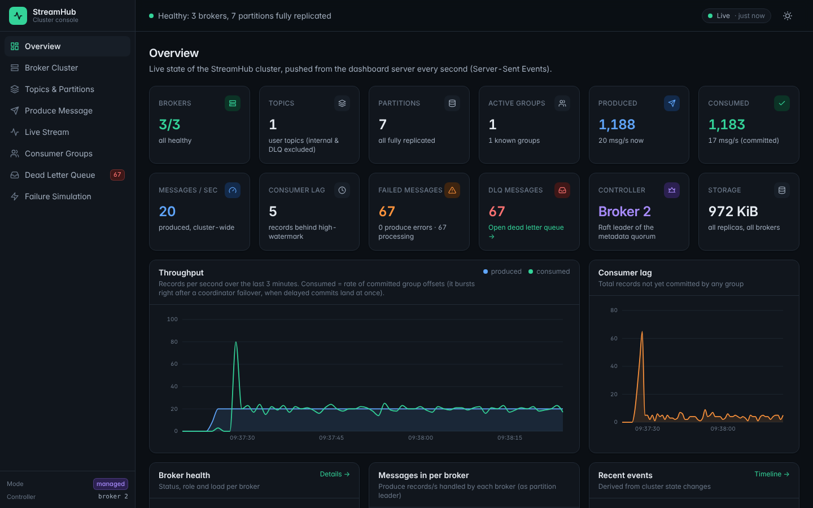
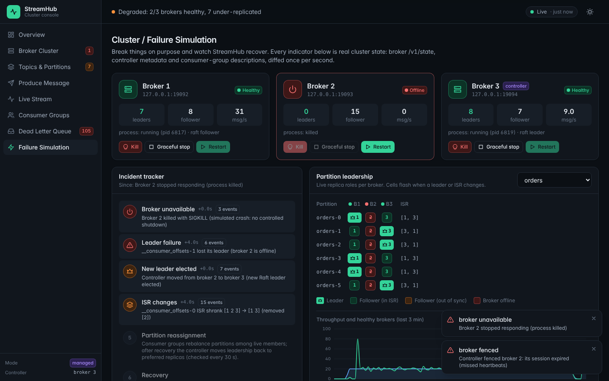
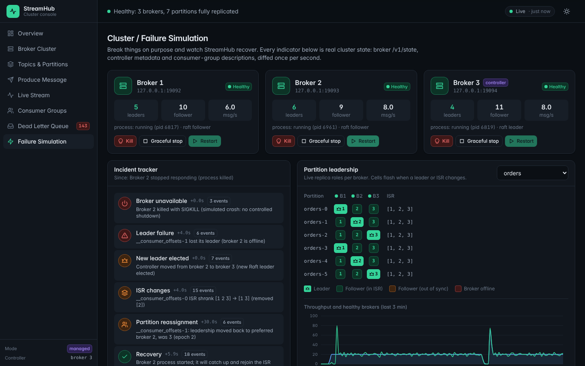

# StreamHub Dashboard

A web console for demonstrating and monitoring a StreamHub cluster:
React 19 + TypeScript + Tailwind CSS v4, charts drawn with d3. Every
number on every page comes from the running cluster; there is no mock or
static data.



## Run it

```bash
go build -o bin/streamhub ./cmd/streamhub

# Managed mode: the dashboard launches 3 real broker processes and owns them,
# which enables the broker Kill / Graceful stop / Restart buttons. It also
# creates topic "orders", two demo consumers in group "order-processor" and
# 20 msg/s of traffic (5 % marked to fail processing, so the DLQ fills up).
bin/streamhub dashboard --managed            # http://127.0.0.1:8090

# Attached mode: monitor an existing cluster (broker controls disabled).
scripts/cluster.sh start
bin/streamhub dashboard --bootstrap 127.0.0.1:9092,127.0.0.1:9093,127.0.0.1:9094

# Docker: 3 brokers + dashboard (attached mode).
docker compose up -d --build                 # http://localhost:8090
docker compose kill broker2                  # simulate a broker failure, watch the UI
docker compose start broker2
```

Useful flags: `--demo=false` (no demo topic/consumers/traffic),
`--demo-rate 50`, `--demo-failure-rate 0.1`, `--listen`, `--data-dir`.

## Architecture

```
Browser (React SPA)                 streamhub dashboard (Go)                    Brokers
┌───────────────────┐  SSE /api/events  ┌─────────────────────┐ binary protocol ┌──────────┐
│ pages, charts     │◀──────────────────│ collector (1 s)     │───Metadata─────▶│ broker 1 │
│ one EventSource   │  SSE /api/stream  │ snapshot diff→events│───ListGroups───▶│ broker 2 │
│ REST for actions  │──────────────────▶│ produce / DLQ /     │ HTTP /v1/state  │ broker 3 │
└───────────────────┘                   │ demo consumers      │────────────────▶│          │
                                        │ process manager     │ (fork/kill in   │          │
                                        └─────────────────────┘  managed mode)  └──────────┘
```

* Browsers cannot speak the broker's binary TCP protocol, so the dashboard
  server is a small backend-for-frontend. It uses the normal Go client
  (the same producer, consumer and group code as any application) plus
  each broker's `/v1/state` JSON endpoint (role, ISR, LEO, HW, size and
  counters for every hosted replica).
* Once per second it builds a **snapshot** of the whole cluster, diffs it
  with the previous one into **timeline events** (broker unavailable,
  fenced, leader lost/elected, ISR shrink/expand, rebalance, recovery,
  leadership moved back) and pushes both over **Server-Sent Events**. The
  browser holds one `EventSource` and never polls.
* The live message stream is a second SSE connection: the server tails the
  selected partitions with partition consumers (long-poll fetches) and
  pushes each record as it is committed.
* The compiled app is embedded in the Go binary (`internal/dashboard/ui/dist`,
  committed), so `go build` alone produces a working dashboard.

## Pages

| Page | What it shows | Where the data comes from |
|---|---|---|
| Overview | brokers healthy/offline, topics, partitions, active groups, produced, consumed, msg/s, consumer lag, failed messages, DLQ messages, controller, storage; throughput and lag charts; per-broker load; recent events | snapshot |
| Broker Cluster | ID, host:port, health, leader/follower partition counts, msg/s, storage; details drawer with Raft role, uptime, counters and every hosted replica | metadata + `/v1/state` |
| Topics & Partitions | tree `Partition N → Broker X [Leader]`, replicas, ISR, latest offset, high-watermark, lag; create/delete topics | metadata + leader `/v1/state` + group offsets |
| Produce Message | topic, partition (auto or manual), key, JSON payload with templates, acks 0/1/all; result: message ID, partition, offset, ack status, latency | `POST /api/produce` (real producer) |
| Live Stream | timestamp, topic, partition, offset, key, payload, producer ack, consumer status; filter by topic/partition and group; pause/clear | `GET /api/stream` (SSE) |
| Consumer Groups | state, strategy, generation, members, partition→consumer assignment (colour per member), committed vs latest offset, lag; start/crash/stop demo consumers | ListGroups/DescribeGroup + HW |
| Dead Letter Queue | failed messages, retry count, error, original topic/partition/offset, timestamp, group; Retry and Edit-then-retry | records in `<topic>.dlq` + `__dlq_retries` |
| Failure Simulation | broker cards with Kill (SIGKILL) / Graceful stop / Restart, consumer crash, traffic generator, live leadership matrix, six-step incident tracker, event timeline | snapshot + process manager |



The incident tracker lights up as the cluster reacts to a failure:
1. **Broker unavailable** — its `/v1/state` stops answering.
2. **Leader failure** — partitions it led have no working leader.
3. **New leader elected** — the controller picks an ISR member (epoch +1);
   if the dead broker was the controller, Raft elects a new one first.
4. **ISR changes** — the dead replica leaves the in-sync set.
5. **Partition reassignment** — consumer groups rebalance among live
   members; after recovery the controller moves leadership back to the
   preferred replica (checked every 30 s).
6. **Recovery** — the broker restarts, truncates any divergent tail,
   catches up and rejoins every ISR.



## HTTP API (dashboard server)

| Method | Path | Purpose |
|---|---|---|
| GET | `/api/events` | SSE: `snapshot` (1/s), `history` (on connect), `event` (each timeline event) |
| GET | `/api/snapshot` | one snapshot (+ recent events) as JSON |
| GET | `/api/stream?topic=&partition=&backfill=30` | SSE: `message` per record |
| POST | `/api/produce` | `{topic, key, value, acks: "0"\|"1"\|"all", partition?}` |
| POST / DELETE | `/api/topics`, `/api/topics/{name}` | create / delete topic |
| GET | `/api/dlq` | DLQ entries with eligibility |
| POST | `/api/dlq/retry` | `{id, payload?}`; 409 if not eligible |
| POST | `/api/demo/traffic` | `{running, topic, rate, failureRate}` |
| POST | `/api/demo/consumers` | `{group, topic, delayMs, strategy}` |
| POST | `/api/demo/consumers/{id}/{crash\|stop\|restart}` | consumer failure simulation |
| POST | `/api/cluster/brokers/{id}/{kill\|stop\|start}` | broker failure simulation (managed mode only) |

## What the backend cannot support (and what the UI does instead)

* **DLQ is not a broker feature.** StreamHub, like Kafka, has no built-in
  dead-letter queue. Dead-lettering is done by the dashboard's demo
  consumers: a record whose JSON has `"simulateFailure": true` fails 3
  in-process attempts and is written (acks=all) to `<topic>.dlq` as an
  envelope with the error and origin. Consumers you run yourself only
  appear on the DLQ page if they write the same envelope format.
* **DLQ retry state** (an entry may be retried once; a message may be
  re-driven at most 3 times) is stored in the internal topic
  `__dlq_retries`, so it survives dashboard restarts. Without
  transactions there is a small window (re-published, mark not yet
  written) in which a crash would allow one extra retry.
* **"Failed messages"** = produce requests the brokers answered with an
  error (since each broker started) + records the demo consumers could not
  process. The broker has no other notion of a failed message.
* **Message ID** is `topic/partition/offset`: StreamHub records have no
  message IDs and no headers.
* **Producer acknowledgement** in the live stream is known only for records
  produced through the dashboard (Produce page, traffic generator, DLQ
  retry). Any other record is shown as "committed to ISR", which is true of
  everything a consumer can read (consumers only see below the
  high-watermark). acks=0 records have no offset in their result.
* **Consumer status** is derived from the selected group's committed
  offsets (1 s granularity): "processed" = below the committed offset.
  There is no per-message delivery tracking.
* **Broker failure buttons need managed mode** (the dashboard must own the
  processes to signal them). In attached or Docker mode, stop brokers with
  your own tools (`scripts/cluster.sh kill 2`, `docker compose kill
  broker2`); the dashboard still shows the whole failure sequence.
* **Consumer failure** can be simulated only for the dashboard's own demo
  consumers; it cannot crash consumers running elsewhere.
* **Network partitions** are not simulated from the UI (the transport's
  fault injection exists only in tests).
* **Partition reassignment** in StreamHub means *leadership* moving
  (failover, preferred-leader restore) and *consumer* reassignment
  (rebalance). Replicas never move between brokers; there is no replica
  reassignment tool.
* **Real-time path:** browser ← SSE ← dashboard server. The dashboard
  server itself polls the brokers once a second (metadata, `/v1/state`,
  group descriptions): brokers have no push API. Events therefore have
  ~1 s resolution.
* **Consumed/s** is the rate of committed group offsets. It bursts right
  after a coordinator failover, when commits delayed by the outage land at
  once. While a coordinator fails over, the group's last known state is
  shown (flagged stale) for up to 30 s rather than dropping out.

## Building the UI

```bash
cd web
npm ci               # exact versions from package-lock.json
npm run typecheck    # tsc --noEmit against the real React types
npm run build        # esbuild + Tailwind v4 → ../internal/dashboard/ui/dist
```

The compiled app is committed (it is embedded with `go:embed`), so rebuild
and commit `internal/dashboard/ui/dist` after changing anything in `web/`.

The build uses esbuild and Tailwind's JS API directly (`web/build.mjs`)
instead of Vite, and d3 for charts. That choice dates from development in
an environment without npm registry access. `build.mjs`/`typecheck.mjs`
still fall back to a pre-installed package store (`STREAMHUB_NODE_MODULES`,
default `/opt/npm-tools/node_modules`) and, when `@types/react` is missing
there, to minimal React type shims (`web/src/shims`,
`tsconfig.offline.json`). With `npm ci` the real packages and types are
used.

**Verified:** `npm install` (80 packages, 0 vulnerabilities reported),
`npm run typecheck` against the real `@types/react` 19.3.0 with TypeScript
5.9.3 exits 0, and a deliberately planted type error
(`<div onClick={42} />`) was reported as TS2322, so the check is effective.
`npm run build` produced the committed bundle (React 19.3.0, esbuild
0.25.12), which loaded on all 9 routes in dark and light themes in Chromium
with no console errors.

## Tests

`go test -race ./internal/dashboard` runs:
* snapshot-diff unit tests for the whole failure sequence (unavailable →
  fenced → leader lost/elected → ISR shrink → recovery → leadership moved
  back), partition offline, controller change, rebalance;
* an end-to-end test against a real 3-broker in-process cluster through
  the HTTP API: topic creation, produce with acks 0/1/all and invalid acks,
  snapshot contents, SSE `/api/events` and `/api/stream`, a demo consumer
  dead-lettering a poison message, retry and 409 on a second retry, broker
  killed → leader election + ISR shrink + offline broker in events,
  broker control refused in attached mode;
* regression tests for bugs found while verifying the dashboard (below).
